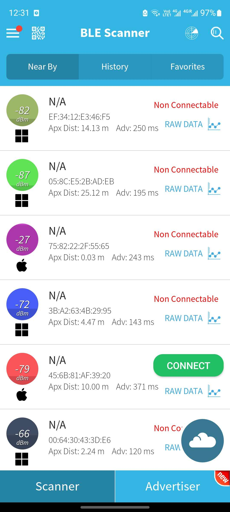

# BLE Signal Analysis and Environmental Characterization

## 1. Objective

The goal of this assignment is to investigate and analyze nearby Bluetooth Low Energy (BLE) devices using mobile scanning tools. The study focuses on how different environments (Classroom, Hallway, and Outdoors) affect signal strength (RSSI), device density, and data accuracy.

## 2. Methodology

- **Hardware:** Samsung Galaxy S21
- **Software:** BLE Scanner Mobile Application
- **Procedure:** 1. Performed real-time scans in three distinct environments. 2. Recorded RSSI, MAC addresses, and estimated distances. 3. Analyzed the correlation between physical obstacles and signal degradation.

---

## 3. Data Collection & Environments

### 3.1 Environment 1: Classroom (High Density)

The classroom environment is characterized by a high density of electronic devices (laptops, tablets, wireless headphones) and physical obstructions (desks, chairs, and human bodies).

**Data Snapshot:**

| Device Icon |    MAC Address    | RSSI (dBm) | Estimated Distance | Connectable |
| :---------: | :---------------: | :--------: | :----------------: | :---------: |
|    Apple    | 75:82:22:2F:55:65 |  -27 dBm   |       0.03 m       |     No      |
|   Generic   | 00:64:30:43:3D:E6 |  -66 dBm   |       2.24 m       |     No      |
|   Generic   | 3B:A2:63:4B:29:95 |  -72 dBm   |       4.47 m       |     No      |
|    Apple    | 45:6B:81:AF:39:20 |  -79 dBm   |      10.00 m       |   **Yes**   |
|   Generic   | EF:34:12:E3:46:F5 |  -82 dBm   |      14.13 m       |     No      |
|   Generic   | 05:8C:E5:2B:AD:EB |  -87 dBm   |      25.12 m       |     No      |

**Screenshot:**

### 3.2 Environment 2: Hallway (Long Corridor)

_Observations: Signals in the hallway often show a "waveguide effect" where the signal travels further but suffers from reflections off the walls._

### 3.3 Environment 3: Outdoor Area (Open Space)

_Observations: Outdoors, the relationship between distance and RSSI is more linear due to the lack of multipath interference from walls._

---

## 4. Technical Analysis

### 4.1 RSSI vs. Distance Relationship

The Received Signal Strength Indicator (RSSI) is measured in dBm. The relationship follows the log-distance path loss model:

$$RSSI = P_0 - 10n \log_{10}(d/d_0)$$

Where:

- $P_0$ is the signal strength at 1 meter.
- $n$ is the path loss exponent (usually 2 for free space, higher for indoors).
- $d$ is the distance.

**Observation:** In the collected data, a device at -27 dBm was effectively at 0.03m, while -87 dBm dropped the estimated distance to over 25m.

### 4.2 Anomalies and Interference

- **Multipath Fading:** In the classroom, RSSI values fluctuated even when the device was stationary
